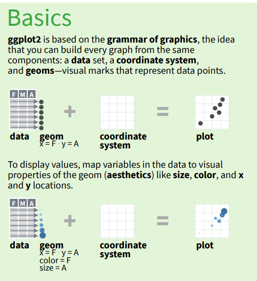

**Descriptive stats can be misleading. Always visualize your data!**


```{r, echo = FALSE, eval = TRUE, purl = FALSE}
## silently read in CSV file from FigShare

variants <- readr::read_csv("https://ndownloader.figshare.com/files/14632895")
```

The tidyverse package to visualise data is `ggplot2.`

We start by loading the package `tidyverse` or **`ggplot2`**.

```{r load-ggplot2}
library(ggplot2)
```



There are different ways of mapping aesthetics to visual features -

-   scatterplots

-   bar plots,

-   line plots, and

so on.

These differ in their geometry and so are referred to as "geometries",
or "**geom**" for short.

## Plotting with **`ggplot2`**

**`ggplot2`** is designed to works with tidy data, i.e.,

1.  a column for every variable,

2.  and a row for every observation.

Well-structured data will save you lots of time when making figures with
**`ggplot2`**.

If you need to reorganise your data, you can use other tidyverse
packages such as **`dplyr`** and **`tidyr`**, and then afterwards plot
the reorganised data using **`ggplot2`**.

ggplot graphics are built step by step by adding new elements.

Adding layers in this fashion allows for extensive flexibility and
customization of plots.

To build a ggplot, we will use the following basic template that can be
used for different types of plots:

```{r, eval=FALSE}
ggplot(data = <DATA>, mapping = aes(<MAPPINGS>)) +  <GEOM_FUNCTION>()
```

The `ggplot()` function sets up an empty plot, which is "bound" to a
specific data frame, using the `data` argument.

We will use the `variants` data frame from earlier in this workshop.

```{r}
ggplot(data = variants)
```

The aesthetic (`aes`) function defines a mapping by selecting the
variables to be plotted and specifying how to present them in the plot.

Here we use

-   genomic position `POS` for the `x` position,

-   and read depth `DP` for the `y` position.

```{r, eval=FALSE, purl=FALSE}
ggplot(data = variants, 
       aes(x = POS, 
           y = DP))
```

'geoms' provide graphical representations of the data in the plot.

**`ggplot2`** offers many different geoms; we will use some common ones
today, including:

      * `geom_point()` for scatter plots, dot plots, etc.
      * `geom_bar()` for, well, barplots!


To add a geom to the plot we use the `+` operator. Because we have two
continuous variables, let's use `geom_point()` first:

```{r first-ggplot, purl=FALSE}
ggplot(data = variants, aes(x = POS, y = DP)) +
  geom_point()
```

The `+` in the **`ggplot2`** package allows you to modify existing
`ggplot` objects, by adding more plot elements. This means you can
easily set up plot templates and conveniently explore different types of
plots, like this:

```{r, first-ggplot-with-plus, eval=FALSE, purl=FALSE}
# Assign plot to a variable
coverage_plot <- ggplot(data = variants, aes(x = POS, y = DP))

# Draw the plot
coverage_plot +
    geom_point()
```

**Notes**

-   Data and aesthetics in the `ggplot()` function can be seen by geom
    layers that you add (i.e., these are universal plot settings).

    -   This includes the x- and y-axis mapping you set up in `aes()`.

-   You can instead specify mappings for a given geom to replace or add
    to those mappings defined globally in the `ggplot()` function.

-   The `+` sign used to add new layers must be placed at the end of the
    line containing the *previous* layer.

    -   This is because R assumes that the end of a line is the end of a
        command, unless you tell it otherwise. So, if the `+` sign is
        added at the beginning of the next line containing the new
        layer, **`ggplot2`** will not add that new layer and will return
        an error message.

```{r, ggplot-with-plus-position}
# This is the correct syntax for adding layers
coverage_plot +
  geom_point()
```

# This will not add the new layer and will return an error message

```{r, ggplot-with-plus-position, eval=FALSE, purl=FALSE}
coverage_plot
  + geom_point()
```

## Building your plots iteratively: geoms.

Building plots with **`ggplot2`** is typically an iterative process. We
start by defining the dataset we'll use, lay out the axes, and choose a
geom:

```{r create-ggplot-object}
ggplot(data = variants, 
       aes(x = POS, y = DP)) +
  geom_point()
```

To be clear, this plot tells us the position and read depth of each
genomic variant.

To learn more, we start modifying this plot.

For example nearby points may be "overplotted" so that it is hard to
distinguish one point frommany nearby points.

To reduce overplotting, we can add transparency using the aesthetic
(`alpha`):

```{r adding-transparency, purl=FALSE}
ggplot(data = variants, 
       aes(x = POS, y = DP)) +
    geom_point(alpha = 0.5)
```

## Using colors as an aesthetic

If plotting with a different color is more clear, we can add colors for
all the points:

For example, here we add `color = "blue"` to all points.

```{r adding-colors}

ggplot(data = variants, 
       aes(x = POS, 
           y = DP)) +
  geom_point(alpha = 0.5, 
             color = "blue")
```

To add sample-specific visual information, we can color each sample in
the plot differently.

**`ggplot2`** is designed to make it easy to map variables to visual
aesthetics, such as **color**.

Here is an example where map color to **`sample_id`**:

```{r color-by-sample-1, purl=FALSE}
ggplot(data = variants, 
       aes(x = POS, 
           y = DP, 
           color = sample_id)) +
  geom_point(alpha = 0.5)
```

> ## Challenge:
>
> 1.  What is the difference between `color = sample_id` (no quotes) and
>     `color = "sample_id"` (quotes)?
> 2.  What is the difference between specifying color **inside** the
>     `aes()` function, or **outside**?
>
> > ## Solution
> >
> > ```{r, echo=TRUE}
> > ggplot(data = variants, 
> >        aes(x = POS, 
> >            y = DP, 
> >            color = "sample_id")) +
> >  geom_point(alpha = 0.5)
> > ```
> >
> > In this case, `ggplot` interprets `color = "sample_id"` as mapping
> > the *string* `"sample_id"`, not the variable `sample_id`. These
> > distinctions turn out to be important.
> >
> > {: .solution} {: .challenge}

## Changing geoms

We can plot the same aesthetic mappings using different geometries.

For example, we can change the geom from point to column, and positions
and colors will be still determined in the same way, but they will look
different:

We change change `geom_point` to `geom_col` to generate a bar chart
based on the values of the depth.

```{r color-by-sample-2,}
ggplot(data = variants, 
       aes(x = POS, 
           y = DP, 
           color = sample_id)) +
  geom_col(alpha = 0.5)
```

To find out more about the different aesthetics, you can use the help
functions,

such as `?geom_point` and `?geom_col`.

There are many more useful resources that we link to below.

## Building plots iteratively: axis labels

To make our plot more interpretable, we can add axis labels using
`labs()`:

For example to change the x axis label to "Base Pair Position" and y to
"Read Depth (DP)";

```{r add-axis-labels}
ggplot(data = variants, aes(x = POS, 
                            y = DP, 
                            color = sample_id)) +
  geom_jitter(alpha = 0.5) +
  labs(x = "Base Pair Position",
       y = "Read Depth (DP)")
```

## Scales

`ggplot` also allows you to change the way in which variables are mapped
to aesthetics, using **scales**.

For example, variables that are widely dispersed may be easier to
visualise on a log scale.

Here we use the built-in `scale_y_log10` scale function to display the
y-axis on a log(10) scale.

```{r y-log10-scale, purl=FALSE}
ggplot(data = variants, 
       aes(x = POS, 
           y = DP, 
           color = sample_id)) +
  geom_jitter(alpha = 0.5) +
  labs(x = "Base Pair Position",
       y = "Read Depth (DP)") +
  scale_y_log10()
```

Although we could transform the x-axis using `scale_x_log10`, that would
be absurd for genomic position.

To find out more about different scales, you can again use the help
functions, such as `?scale_y_log10`.

Or, type `scale_` and tab autocomplete to find out what other options
are available.

> ## Challenge
>
> Use what you just learned to create a scatter plot of mapping quality
> (`MQ`) over position (`POS`) with the samples showing in different
> colors. Make sure to give your plot relevant axis labels.
>
> Does it make sense to try a different y-axis scale here?
>
> > ## Solution
> >
> > ```{r scatter-challenge, purl=FALSE}
> >  ggplot(data = variants, 
> >         aes(x = POS, 
> >             y = MQ, 
> >             color = sample_id)) +
> >   geom_point() +
> >   labs(x = "Base Pair Position",
> >        y = "Mapping Quality (MQ)")
> > ```
> >
> > {: .solution} {: .challenge}

## Creating subplots by Faceting

**`ggplot2`** has a feature called *faceting* that allows the user to
split one plot into multiple plots based on a factor included in the
dataset.

This offers an alternative to coding different factors by,

for example, colour or shape.

We will use it to split our read depth plot into three panels, one for
each sample.

```{r first-facet}
ggplot(data = variants, aes(x = POS, 
                            y = DP, 
                            color = sample_id)) +
 geom_point() +
 labs(x = "Base Pair Position",
      y = "Read Depth (DP)") +
 facet_grid(. ~ sample_id)
```

This looks ok, but it would be easier to read if the plot facets were
stacked vertically rather than horizontally.

The `facet_grid` geometry allows you to explicitly specify how you want
your plots to be arranged via formula notation (`rows ~ columns`;

a `.` can be used as a placeholder that indicates only one row or
column).

```{r second-facet, purl=FALSE}
ggplot(data = variants, aes(x = POS, 
                            y = DP, 
                            color = sample_id)) +
 geom_point() +
 labs(x = "Base Pair Position",
      y = "Read Depth (DP)") +
 facet_grid(sample_id ~ .)
```

In this case, stacking the plots vertically makes sense as all samples
measure read depth along the same genome, represented by the x-axis.

## Building plots iteratively: adjusting plot appearance with themes

Plots have many visual elements besides the data - axis and tick labels,
grid lines, background colours, and so on. All of these can vary in
their appearance.

Text elements vary in font.

Most elements vary by their size and color, and even by their presence
or absence.

ggplot controls the appearance of these other plot elements with
**themes**.

For example, plots with white background look more readable when
printed.

We can set the background to white using built-in theme, `theme_bw()`:

```{r facet-plot-white-bg}
ggplot(data = variants, aes(x = POS, 
                            y = MQ, 
                            color = sample_id)) +
  geom_point() +
  labs(x = "Base Pair Position",
       y = "Mapping Quality (MQ)") +
  facet_grid(sample_id ~ .) +
  theme_bw()
```

We can remove individual plot elements that aren't needed, for example
the grid lines:

```{r facet-plot-white-bg-no-grid}
ggplot(data = variants, aes(x = POS, 
                            y = MQ, 
                            color = sample_id)) +
  geom_point() +
  labs(x = "Base Pair Position",
       y = "Mapping Quality (MQ)") +
  facet_grid(sample_id ~ .) +
  theme_bw() +
  theme(panel.grid = element_blank())
```

> ## Challenge
>
> Use what you just learned to create a scatter plot of PHRED scaled
> quality (`QUAL`) over position (`POS`) with the samples showing in
> different colors. Make sure to give your plot relevant axis labels.
>
> > ## Solution
> >
> > ```{r scatter-challenge-2, purl=FALSE}
> >  ggplot(data = variants, aes(x = POS, 
> >                              y = QUAL, 
> >                              color = sample_id)) +
> >   geom_point() +
> >   labs(x = "Base Pair Position",
> >        y = "PHRED-sacled Quality (QUAL)") +
> >   facet_grid(sample_id ~ .)
> > ```
> >
> > {: .solution} {: .challenge}

In addition to `theme_bw()`, which changes the plot background to white,
**`ggplot2`** comes with several other themes which can be useful to
quickly change the look of your visualization.

The complete list of themes is available at
<https://ggplot2.tidyverse.org/reference/ggtheme.html>.
`theme_minimal()` and `theme_light()` are popular, and `theme_void()`
can be useful as a starting point to create a new hand-crafted theme.

The [ggthemes](https://jrnold.github.io/ggthemes/reference/index.html)
package provides a wide variety of options (including an Excel 2003
theme).

The [**`ggplot2`** extensions
website](https://exts.ggplot2.tidyverse.org/) provides a list of
packages that extend the capabilities of **`ggplot2`**, including
additional themes.

## Making barplots to count the number of observations in groups

Plots with similar appearances can mean different things.

Earlier we used `geom_col` to plot read depth (DP) as the height of a
column.

However, bar plots are commonly used to count the number of observations
in groups.

ggplot distinguishes between `geom_col`, which plots the value supplied,
and `geom_bar`, which does the counting for you.

We can create barplots of counts using `geom_bar`:

Let's make a barplot showing the number of variants for each sample that
are indels using the `INDEL` column.

**Note:** we do not need to specify a y value as geom_bar automatically
calculates it.

```{r barplot}
ggplot(data = variants, 
       aes(x = INDEL)) +
  geom_bar() +
  facet_grid(sample_id ~ .)
```

> ## Challenge
>
> Since we already have the `sample_id` labels on the individual plot
> facets, we don't need the legend.
>
> Use the help file for `geom_bar` and any other online resources you
> want to use to remove the legend from the plot.
>
> > ## Solution
> >
> > ```{r barplot-challenge, purl=FALSE}
> > ggplot(data = variants, 
> >        aes(x = INDEL, c
> >            olor = sample_id)) +
> >    geom_bar(show.legend = F) +
> >    facet_grid(sample_id ~ .)
> > ```
> >
> > {: .solution} {: .challenge}

There is much more flexibility in terms of statistical summaries and
counting in ggplot, but we don't have time to cover it in this lesson.

To export a plot to a file, use the **Export** button, in the bottom
right plotting window in RStudio.

Or you can write this into a script using the function `ggsave` -
remember, use `?ggsave` to ask for help from your R session.

> ## Challenge
>
> With all of this information in hand, please take another five minutes
> to either improve one of the plots generated in this exercise or
> create a beautiful graph of your own. U
>
> se the RStudio [**`ggplot2`** cheat
> sheet](https://github.com/rstudio/cheatsheets/raw/master/data-visualization-2.1.pdf)
> for inspiration. Here are some ideas:
>
> -   See if you can change the size or shape of the plotting symbol.
> -   Can you find a way to change the name of the legend? What about
>     its labels?
> -   Try using a different color palette (see
>     [http://www.cookbook-r.com/Graphs/Colors\_(ggplot2)/](http://www.cookbook-r.com/Graphs/Colors_(ggplot2)/){.uri}).
>     {: .challenge}

> ## Tip: Where to learn more about plotting
>
> There are amazing online and print resources for learning more about
> ggplot2. Some of them talk about the ideas behind plotting, and give
> galleries of examples. Others are more practical about how to program
> with ggplot2. - [R for ecology
> ggplot2](https://datacarpentry.org/R-ecology-lesson/04-visualization-ggplot2.html):
> Episode from Data Carpentry lesson introducing ggplot with a different
> example dataset. <https://ggplot2-book.org/> - [ggplot2: elegant
> graphics for data analysis](https://ggplot2-book.org/): By Hadley
> Wickham, Danielle Navarro, and Thomas Lin Pedersen. Gives some basics
> of ggplot2, but its primary focus is explaining the Grammar of
> Graphics that ggplot2 uses. - [Data Visualization: A Practical
> Introduction](https://kieranhealy.org/publications/dataviz/): By
> Kieran Healy. Teaches how to makedata visualizations with R and
> ggplot2 in a clear, sensible, and reproducible way. Accompanied by the
> `socviz` package with example code. - [Fundamentals of Data
> Visualization](https://clauswilke.com/dataviz/): By Claus Wilke. A
> guide to making visualizations that accurately reflect the data, tell
> a story, and look professional. Complete source code, with plots made
> in ggplot2, is available. {: .callout}

[Cédric Scherer
(cedricscherer.com)](https://www.cedricscherer.com/top/dataviz/)
